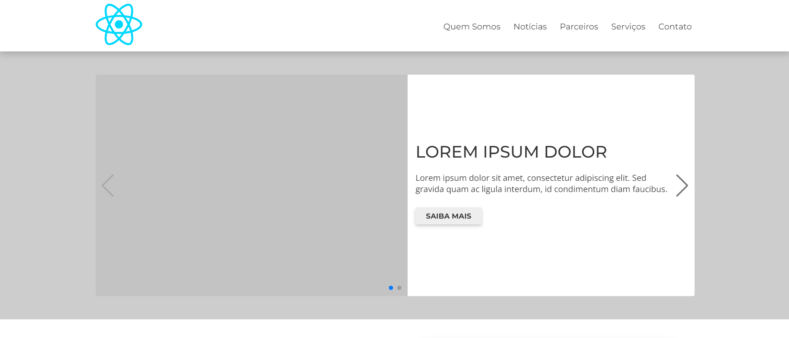
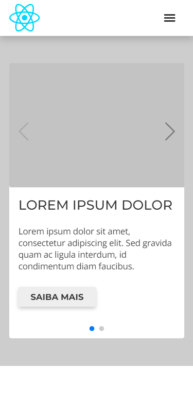
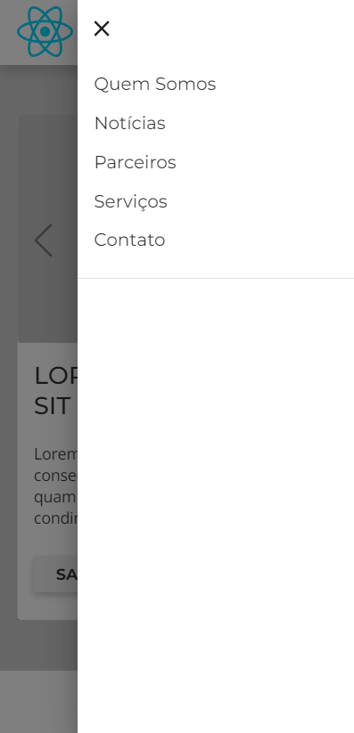

# React + Vite

This template provides a minimal setup to get React working in Vite with HMR and some ESLint rules.

Currently, two official plugins are available:

- [@vitejs/plugin-react](https://github.com/vitejs/vite-plugin-react/blob/main/packages/plugin-react/README.md) uses [Babel](https://babeljs.io/) for Fast Refresh
- [@vitejs/plugin-react-swc](https://github.com/vitejs/vite-plugin-react-swc) uses [SWC](https://swc.rs/) for Fast Refresh

## O projeto

Esse é uma base de código para sites institucionais/blog.
Possui algumas seções padrões como: banner, quem somos, notícias, entre outros..., como também vários outros componentes.

## Node

Esse projeto utiliza a versão 18.17.1 do Node

## Start

Para rodar basta seguir os seguintes comandos:
- yarn install (instalar as dependências)
- yarn dev (rodar em modo de desenvolvimento)

### Imagens do projeto

